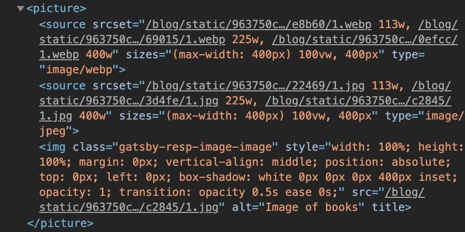

## Gatsby : Modern web tech without the headache

Gatsby นั้นนับว่าเป็น _static site generator_ ที่น่าสนใจมากใน ecosystem ของ **React.js** โดยที่ผ่านมานั้นผมเคยได้ลองเจ้า **Next.js** และชื่นชอบหลายๆอย่างของมันมาก โดย **Next.js** นั้นผมรู้สึกว่า หากเคยใช้ **React.js** มาก่อนแล้ว learning curve ค่อนข้างต่ำ และ **document** ก็ค่อนข้างพร้อม แถมมี examples ที่ยกตัวอย่าง integration กับ **third-party library** อยู่เยอะมากๆ

### ทำไมถึงต้องเป็น Gatsby ?

สดๆร้อนๆกันเลยกับ **blog** ใหม่ของเฮีย **Dan Abramov** - **[overreacted.io](https://overreacted.io/)** ก็ยังใช้ **Gatsby** หรือแม้แต่ **official** **[reactjs.org](https://reactjs.org/)** เองก็ด้วย ทำไมกันนะ มันมีดีอะไร

มีรอช้าผมก็จัดการเปิด doc ของ **Gatsby** แล้วลองทำอะไรซักอย่างขึ้นมา โดยผมคิดอะไรไม่ออกว่าจะทำอะไรสนุกๆดี พอดีมีพี่ที่ทำงานชอบบ่นมาผมทำไมถึงไม่ชอบเขียนบล้อคบ้าง ผมก็เลยปิ้งไอเดียว่า

> เออ ทำบล้อคดีกว่า, ทำเอง เขียนเอง
>
> เผื่อจะมีกำลังใจในการเขียนกว่าบน medium.com

ประกอบกับ **Gatsby** นั้นได้รับความนิยมในการใช้ทำ blog เป็นอย่างสูง แถมยังมีตัวอย่างจำพวก **starter** อีกเยอะเยะมากมายให้เลือกใช้

**Gatsby** นั้นจะเป็นระบบ **plugin** ที่ประมาณว่าเราอยากได้อะไร ก็แค่ `npm install` ลงไป config นิดหน่อยก็ใช้ได้เลย ซึ่งแน่นอนแหละ ความง่ายนั้นก็แลกมาด้วยระดับของการ **customization** แต่ใครแคร์ ผมแค่จะทำบล้อคเอง 5555

ตัวอย่าง **plugin** ของ **Gatsby**

1. `gatsby-transformer-remark` โดยเจ้าเนี่ย จะแปลง **markdown** ให้เป็น **html** ทำให้เราเขียน blog ใน markdown file ได้ นอกจากนั้นเรายังสามารถ query พวก excerpt หรือ content แบบย่อๆของ markdown ของเราด้วย โดยเราจะสามารถดึง content นั้นๆมาด้วย `graphql`

2. `gatsby-remark-images` เจ้านี่จริงๆแล้วคือ plugin ของ plugin ข้างบนอีกที มันจะทำให้เราสามารถทำให้รูปใน markdown ของเราแสดงไม่ใช่แค่บน **localhost** แต่บน **production** ที่เรา **build** ไปเป็น **static files** แล้วอีกด้วย ยังไม่ใช่แค่นั้น!

   

   มันยังทำ `srcset` `sizes` ให้ตามขนาดหน้าจอ ทำให้เราได้ภาพคมชัดในทุกขนาดของหน้าจอ และประหยัด **network** ไปพร้อมๆกัน

   **แต่ยังไม่หมดแค่นั้น !** ถ้าหลายคนเคยอ่าน
   **[medium.com](https://medium.com)** จะสังเกตได้ว่า รูปที่แสดงผลจะเป็น **pregressive image** หรือง่ายๆก็คือ เอารูปที่เบลอๆคุณภาพต่ำๆที่มีขนาดเล็ก render ลงไปให้ user เห็นก่อน แล้วพอรูปขนาดเต็มโหลดเสร็จค่อยเอาไปแทนที่ เพื่อ **UX** ที่ดีกว่า โหลดเป็นตับๆจากบนลงล่าง

   โดยทั้งหมดนี้แค่ `npm install gatsby-remark-images`

   โคตรง่าย...

สรุปเลยแล้วกัน ผมว่าเจ้า **Gatsby** เนี่ยมันทำให้ชีวิตง่ายขึ้นเยอะมากๆ ไม่ต้องปวดหัว implement หลายๆอย่างเช่น plugin รูปที่ผมยกตัวอย่างไปเอง
แบบ **plug n play** ประมาณนั้น และที่สำคัญในเรื่องของ **performance** นั้นไม่เป็นรองใครแน่นอน

ข้อเสียหลักๆก็คือ **ecosystem** ของ **Gatsby** นั้นค่อนข้างจำกัด เนื่องจากระบบที่เป็น plugin และที่สำคัญเลยก็คือต้องทำความเข้าใจ **graphql** ซักหน่อย ซึ่งผมคิดว่าสองเหตุผลนี้แหละที่ทำให้ **learning curve** ของมันสูงกว่า **Nextjs**
